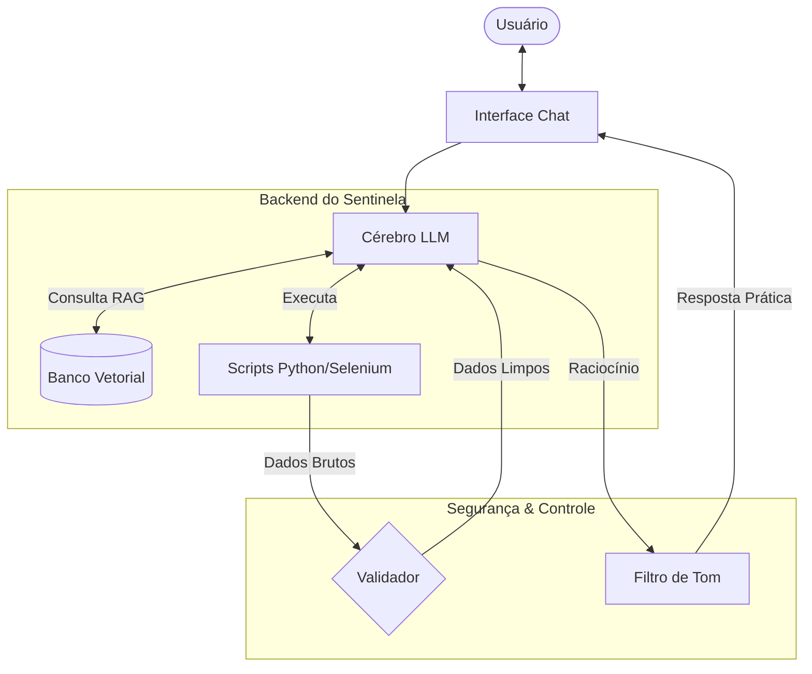

# Documentação do Agente

## Caso de Uso

### Problema
> Qual problema financeiro seu agente resolve?

Muitas pessoas perdem o controle de suas finanças não por falta de vontade, mas pelo esforço repetitivo que as ferramentas tradicionais exigem. Planilhas e aplicativos manuais geram uma carga cognitiva alta, fazendo com que o usuário desista de anotar seus gastos em poucos dias.

### Solução
> Como o agente resolve esse problema de forma proativa?

O agente resolve o problema de forma proativa através da antecipação de cenários e do monitoramento em tempo real, em vez de apenas reagir a gastos passados.

Para sua documentação, aqui estão os três pilares dessa proatividade:

- Alertas de Tendência: O agente identifica padrões de consumo e avisa antes do orçamento estourar (ex: "No ritmo atual, seu limite para lazer acaba em 3 dias").

- Identificação de Anomalias: Ele detecta cobranças duplicadas, assinaturas esquecidas ou aumentos inesperados em contas fixas automaticamente.

- Aconselhamento Contextual: Sugere ajustes imediatos baseados em metas (ex: "Se você economizar R$ 50 nesta semana, compensará o gasto extra de ontem").
### Público-Alvo
> Quem vai usar esse agente?

- Pessoas Ocupadas: Profissionais que não têm tempo (ou paciência) para preencher planilhas e buscam automação.

- Indivíduos com Baixa Disciplina Financeira: Usuários que começam a organizar o dinheiro, mas abandonam o processo pelo excesso de tarefas manuais.

- Novos Poupadores: Pessoas que precisam de orientação clara e traduzida sobre como o comportamento diário afeta seus planos de longo prazo.
---

## Persona e Tom de Voz

### Nome do Agente
- Sentinela

### Personalidade
> Como o agente se comporta?
1. Invisível e Observador (Background)
Ele atua em segundo plano, processando transações (via APIs bancárias ou leitura de mensagens) e classificando dados sem solicitar nada ao usuário. O foco aqui é zero esforço.

2. Conciso e Educado (Interação)
Quando precisa falar, ele é direto. Em vez de relatórios longos, ele envia "pílulas" de informação:

    - "Café da manhã registrado. Você ainda tem R$ 50 para lazer hoje."

3. Vigilante e Preditivo (Proatividade)
Ele antecipa problemas. Se ele percebe que uma conta recorrente subiu de valor ou que o saldo não chegará ao fim do mês, ele interrompe o fluxo para alertar:

"Atenção: sua conta de luz veio 20% acima da média. Quer que eu ajuste o orçamento da semana para compensar?"

4. Gamificado e Motivador
Ele utiliza reforço positivo para moldar hábitos. Se você passa uma semana sem estourar nenhuma categoria, o comportamento dele muda para validar o progresso.
    - Exemplo: "Parabéns! É a sua terceira semana consecutiva dentro da meta de mercado. Você economizou R$ 120 extras para sua viagem."

### Tom de Comunicação
> Formal, informal, técnico, acessível?

- Prático e Casual: Fala de igual para igual, usando gírias leves e um tom descontraído. Parece um colega de trabalho te dando uma dica rápida sobre o almoço.
- Mentor Analítico: Tom profissional e educativo. Explica o "porquê" das coisas (ex: explica o impacto de um juro ou de uma tendência de mercado).

### Exemplos de Linguagem
- Saudação: "Opa! Sentinela no posto. Bora dar aquela geral nas contas pra garantir que nada escape do seu radar hoje?"

- Confirmação: "Saquei! Deixa o eu processar isso aqui. Vou cruzar os dados pra te dar o caminho mais seguro."

- Aviso de Gasto: "Ei, detectei um movimento estranho no seu fluxo. Esse gasto aqui não tava no plano, hein? Vamos ver como isso mexe com sua meta?"

- Conselho de Mentor: "Analisei seu mês e, papo reto: seu custo fixo tá subindo. É o famoso 'efeito esteira', a gente ganha mais e gasta mais sem perceber. Bora dar uma segurada?"

- Erro/Limitação: "Putz, ainda não consegui enxergar esse dado específico. Mas relaxa, o conceito básico disso é [explicação curta]. Quer que eu pesquise mais?"

---

## Arquitetura

### Diagrama

### Componentes

| Componente | Recomendação | Por que para o seu caso? |
| :--- | :--- | :--- |
| **Interface** | **Streamlit** (ou Chainlit) | Permite criar o frontend 100% em Python. O **Chainlit** é excelente para interfaces de chat "out-of-the-box". |
| **LLM** | **Gemini 2.5 Flash** | Integração nativa com sua `google_api`, baixo custo e janela de contexto massiva (1M tokens). |
| **Base de Conhecimento** | **FAISS** (ou ChromaDB) | Busca vetorial local de alta performance, fácil de manipular com Python/NumPy, sem overhead de banco de dados complexo. |
| **Validação** | **Pydantic** (+ Instructor) | Garante que o output do LLM obedeça a tipos e estruturas estritas (JSON válido), essencial para automação segura. |
---

## Segurança e Anti-Alucinação

### Estratégias Adotadas

- [x] Grounding Estrito (RAG): O modelo é instruído via System Prompt a ignorar seu conhecimento prévio de treinamento e responder exclusivamente com base no contexto recuperado do vetor (FAISS), mitigando alucinações externas.

- [x] Rastreabilidade de Fontes: Toda resposta afirmativa deve retornar, obrigatoriamente, o nome do arquivo ou ID do registro (JSON/CSV) que fundamentou a informação, permitindo auditoria pelo usuário.

- [x] Fallback Gracioso (Graceful Degradation): Se a busca vetorial retornar scores de similaridade abaixo do limiar definido (ex: < 0.7), o agente deve responder com uma mensagem padrão de "Informação não encontrada na base", em vez de tentar confabular.

- [x] Validação de Schema (Structured Output): As respostas não são texto livre, mas objetos JSON validados pelo Pydantic, garantindo que o formato de saída (ex: {resposta, fontes, confiança}) seja sempre respeitado para evitar quebras no frontend.

- [x] Guardrails de Tópico: O agente bloqueia prompts fora do domínio específico do cliente, utilizando instruções de sistema e verificação de relevância vetorial.

### Limitações Declaradas
> O que o agente NÃO faz?
- Não inventa dados fora da Base de Conhecimento (RAG Estrito): O agente não deve responder perguntas cujas respostas não estejam contidas nos documentos fornecidos (JSON/CSV/FAISS). Se a informação não estiver na base, ele deve responder "Não tenho essa informação".

- Não executa ações críticas sem confirmação (Human-in-the-loop): O agente não tem permissão para realizar operações de escrita (INSERT/DELETE) no banco de dados ou finalizar transações financeiras/legais de forma autônoma.

- Não retém memória persistente de longo prazo: O contexto da conversa é limitado à sessão atual (st.session_state). Ao recarregar a página, o histórico é perdido (a menos que implementemos um banco de logs).

- Não garante 100% de precisão factual (Zero-Hallucination): Embora validado, o modelo de linguagem (LLM) probabilístico está sujeito a erros de interpretação ou alucinações sutis, exigindo revisão humana para dados sensíveis.

- Não acessa a internet em tempo real: O agente não realiza buscas na web (Google Search) para atualizar informações que não estejam pré-carregadas na base vetorial.